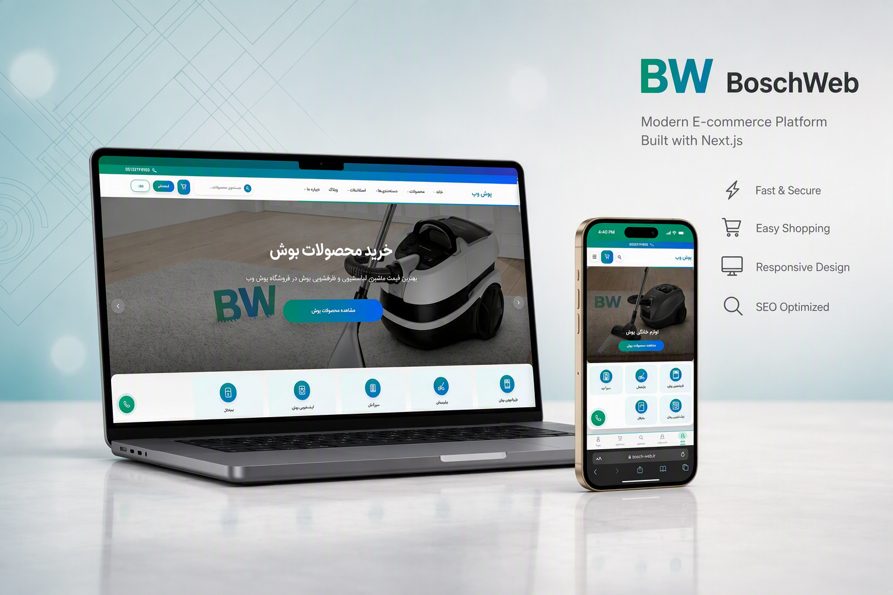
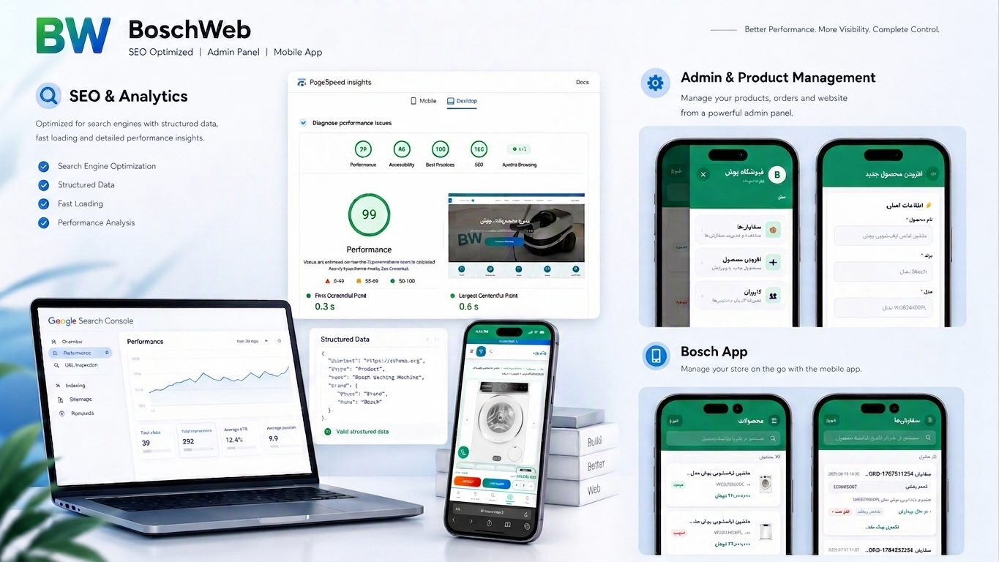
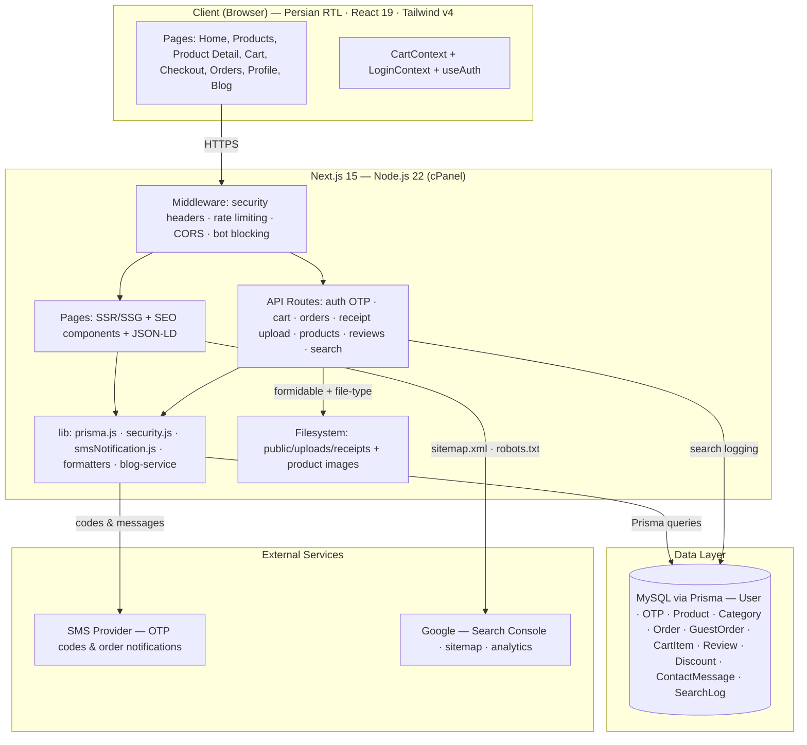
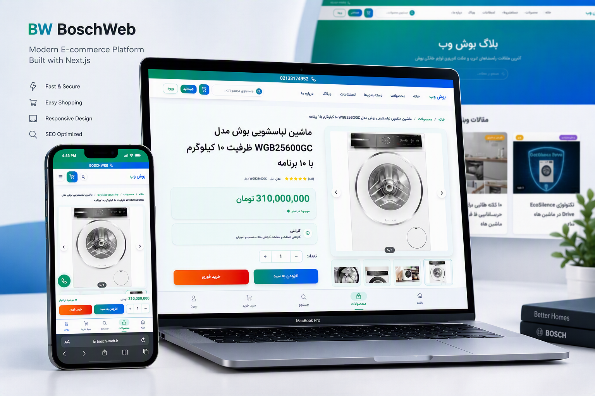

# BoschWeb — Production Full-Stack E-Commerce Platform

A complete production e-commerce platform for Bosch home appliances — **designed, built, deployed, and maintained end-to-end**. From database schema and SMS OTP authentication to SEO architecture and production hosting, on a Persian (RTL) storefront live at **[bosch-web.ir](https://bosch-web.ir)**.

> **Note:** BoschWeb is an independent retail platform for Bosch-branded appliances and is not affiliated with or endorsed by Robert Bosch GmbH.

---

## Table of Contents

- [Project Overview](#project-overview)
- [My Role](#my-role)
- [Problem / Purpose](#problem--purpose)
- [Features](#features)
- [Tech Stack](#tech-stack)
- [Development Work](#development-work)
- [SEO & Google Results](#seo--google-results)
- [Performance & Optimization](#performance--optimization)
- [Deployment & Domain Migration](#deployment--domain-migration)
- [Architecture](#architecture)
- [Screenshots](#screenshots)
- [Results](#results)
- [Live Website](#live-website)

## Project Overview

BoschWeb is a full-stack e-commerce platform selling Bosch home appliances — washing machines, vacuums, and related products — to Persian-speaking customers. It covers the complete customer journey:

- Browse a categorized catalog (best-sellers, new arrivals, special offers)
- Full-text product search with search analytics
- Persistent cart synced across devices and sessions
- Checkout with discount codes, cash-on-delivery, and receipt-based payment verification
- Order history and delivery-status tracking
- SMS OTP registration, login, and password recovery
- Customer reviews, a company blog, and contact management

This is **not a template** — the platform includes a custom API layer, 15+ database models, a security middleware, an SEO system built into the architecture, and an admin/mobile workflow so non-technical staff can run the store. It is in production at **bosch-web.ir**, serving real customers.

## My Role

I handled this project **end-to-end**, on my own:

- **Product & scope** — catalog structure, ordering flow, and admin workflows
- **Backend** — Prisma schema + migrations, REST API (auth, cart, orders, products, reviews, search, blog, uploads), custom Node server
- **Frontend** — the complete Next.js/React storefront with a Persian RTL UI, Tailwind v4, and custom animations
- **Security** — SMS OTP authentication (JWT + bcrypt), middleware with rate limiting, CORS, and bot blocking
- **SEO** — structured data (JSON-LD), dynamic sitemaps, robots.txt, Google Search Console integration
- **Operations** — production deployment, domain migration, SSL/HTTPS, upload housekeeping, and ongoing maintenance

This was not a "front-end only" or "theme customization" job — architecture, backend logic, security, SEO strategy, deployment, and day-to-day production maintenance were all my responsibility.

## Problem / Purpose

The client needed a modern, fast, Google-visible storefront to replace an outdated setup, with:

- A shopping experience competitive with major e-commerce platforms
- Strong Google visibility for appliance-related search terms
- Non-technical staff able to manage products, images, and orders without touching code (admin panel + companion mobile app)
- Reliable order handling in a market without full card-payment infrastructure — including manual payment verification via uploaded receipts and SMS confirmation
- A Persian, right-to-left user experience that feels native

## Features

**Storefront**

- Product catalog with categories, best-sellers, new arrivals, and special offers
- Product pages with galleries, live stock status, and customer reviews
- Full-text search with search analytics — visibility into what customers actually search for
- Persistent cart (`CartContext`) synced to the backend across devices
- Checkout with discount codes, guest orders, and COD / receipt-upload payment options
- Order history, order-success flow, and delivery-status tracking
- SMS-based registration, login, and password recovery (OTP verification)
- User profile and address management
- Company blog with category pages and blog-specific SEO
- Contact form with message management

**Admin & Management**

- Admin panel for managing products, images, and orders
- Companion mobile app — [Product Management App](https://github.com/therealalii/product-management-app) (React Native / Expo / EAS) for remote store management from anywhere

**Security & Infrastructure**

- SMS OTP authentication (JWT + bcrypt) with server-side OTP records
- Middleware: security headers, rate limiting on `/api/*`, CORS handling, bot blocking
- Validated file uploads (formidable + file-type) with an automated cleanup job
- Environment-based configuration (`.env` / `.env.production`)

## Tech Stack

| Layer | Technology |
|---|---|
| Framework | Next.js 15 (Pages Router), React 19 |
| Styling | Tailwind CSS v4, CSS Modules, lucide-react icons |
| UI & animation | embla-carousel, anime.js, split-type |
| Backend | Node.js 22, custom server (`server.js`), Next.js API routes |
| Database / ORM | MySQL via Prisma (15+ models, migrations) |
| Auth | SMS OTP flow, JWT (`jsonwebtoken`), bcrypt hashing |
| Uploads | formidable + file-type → `public/uploads/receipts/` |
| Images | `next/image` + sharp |
| SEO | JSON-LD structured data, dynamic sitemaps, robots.txt, Google Search Console |
| SMS | External SMS provider (`lib/smsNotification.js`) |
| Hosting | cPanel (HostIran) — Node.js 22, MySQL, persistent disk |
| Companion app | React Native, Expo, EAS |

## Development Work

A closer look at the engineering:

- **Auth system** — a complete SMS OTP flow (`send-sms` → `verify-otp`, `check-phone`, `forgot-password-sms`) with JWT sessions and bcrypt-hashed credentials, built from scratch instead of using a third-party auth provider
- **Cart architecture** — `CartContext` + REST sync endpoints (add / load / sync / clear) so carts persist across sessions and devices
- **Order pipeline** — order creation (including guest orders), delivery-status checks, and receipt-upload payment verification for markets without card payments
- **Security middleware** — security headers, in-memory rate limiting on `/api/*`, CORS handling, and bot blocking
- **SEO system** — per-content-type SEO components (`ProductSEO`, `CategorySEO`, `BlogSEO`), JSON-LD `Product` schema, server-generated `sitemap.xml` + `sitemap-images.xml` + `robots.txt`, and Search Console verification served directly by the app
- **Search analytics** — `SearchLog` model plus logging/analytics endpoints to see real customer search behavior
- **Blog engine** — dedicated service layer, card components, and category pages separate from the catalog
- **Database** — Prisma schema and migrations covering 15+ models: users, OTPs, products, categories, orders, guest orders, cart items, reviews, discounts, contact messages, search logs
- **Ops tooling** — a scheduled `cleanup-orphaned-receipts.js` job keeps upload storage clean
- **Performance** — `next/image` + sharp optimization, lazy loading, and SSR/SSG used where it matters

## SEO & Google Results

- Verified in Google Search Console (verification file served by the app itself)
- Dynamic `sitemap.xml` plus a dedicated `sitemap-images.xml` for image-search visibility
- Custom `robots.txt` generation
- JSON-LD `Product` structured data for rich results
- Dedicated SEO components per content type (`ProductSEO`, `CategorySEO`, `BlogSEO`)
- Blog content structured for long-tail organic traffic

## Performance & Optimization

*(The screenshot above shows the live PageSpeed results.)*

- **Google PageSpeed Insights: 99/100** performance score
- **First Contentful Paint: 0.3s** · **Largest Contentful Paint: 0.6s**
- Near-perfect Accessibility, Best Practices, and SEO scores
- Optimized image pipeline (`next/image` + sharp), lazy loading, and a lean client bundle
- Middleware-level protections that don't slow down page delivery

## Deployment & Domain Migration

- **Production hosting** — cPanel (HostIran) running Node.js 22 with the Next.js server, a MySQL database, and persistent disk for uploads
- **Domain migration** — the store was migrated to **bosch-web.ir**: DNS re-pointing, HTTPS/SSL, canonical URLs, regenerated sitemaps, and Search Console re-verification, so search visibility carried over cleanly
- **Config management** — environment-based configuration (`.env` / `.env.production`) keeps local, staging, and production settings isolated
- **Ongoing maintenance** — upload housekeeping, monitoring, analytics review, and iterative feature updates
- I deploy across providers and countries (Vercel, VPS, cPanel/shared hosting) and choose the right infrastructure for each client.

## Architecture

**How the layers connect**

- Every request passes through the middleware — security headers, rate limiting, CORS, bot blocking
- Pages are server-rendered with per-content SEO components and structured data
- All data flows through Prisma into a single MySQL database — one source of truth for store, orders, and analytics
- Receipt uploads land on the persistent disk (no S3 dependency) with an automated cleanup job
- The only third-party services are the SMS gateway and Google (Search Console / analytics)

Full-size diagram: [`architecture/architecture.png`](architecture/architecture.png)

## Screenshots

| Homepage | Product page | SEO & performance |
|---|---|---|
|  |  |  |

## Results

- 99/100 Google PageSpeed performance score
- FCP 0.3s · LCP 0.6s — sub-second load times
- Verified Search Console presence with dynamic sitemaps and image search
- Production store with real orders, reviews, and ongoing management
- **800+ clicks from Google** in the first two months (Search Console)
- Product pages ranking on the **first page of Google** for key appliance searches

## Live Website

🔗 **[bosch-web.ir](https://bosch-web.ir)** — live production storefront.

---

### Related Projects

- [Product Management App](https://github.com/therealalii/product-management-app) — React Native / Expo / EAS companion app for managing this store remotely
- [Nik Wear Portfolio](https://github.com/therealalii/nik-wear-portfolio) — custom WooCommerce e-commerce website & theme

---

*Designed, built, deployed, and maintained end-to-end.*